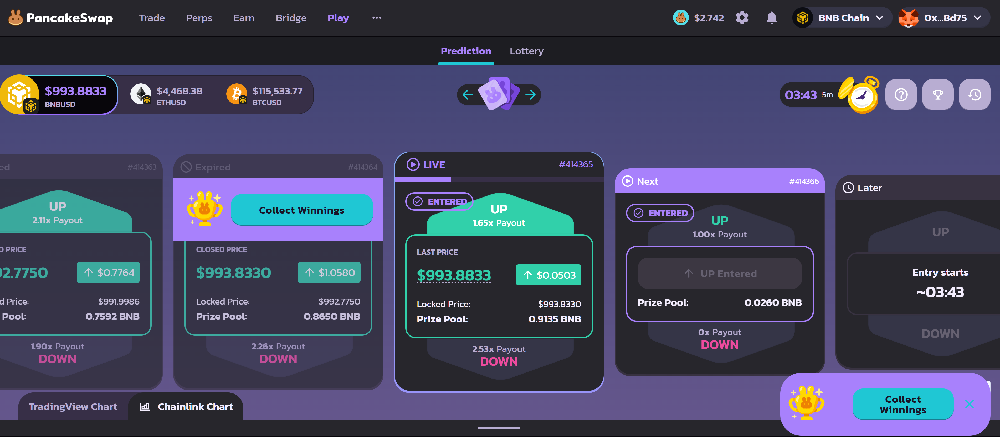

# Project Name
Python-PancakeSwap-Prediction-Auto-Clicker

# About Project

This is my personal experiment, with the following goals:

- Automate clicks in the pancakeswap.finance/prediction system

## What the project can do

- Places bets in PancakeSwap Prediction independently
- Uses screen coordinates for automated mouse clicks




# Prohibitions and Recommendations

- System requirements: Windows + Chrome + MetaMask
- Avoid moving the mouse unnecessarily to prevent shifting during execution
- Do not open MetaMask in a separate tab, as it cancels the MetaMask popup
- Do not resize the browser after setup, as it will require reconfiguring the clicks
- Use only as a separate dedicated computer
- Avoid moving the mouse unnecessarily, as it may disrupt execution

<!-- ---------------------- -->

<details>

  <summary>For Development</summary>

### VERSION

- v0.0.1 – Added automatic order creation
- v0.0.2 – Added automatic winnings collection
- v1.0.0 – Implemented A_AUTORUN flow for auto-login after PC restart
- v1.0.1 – Added configuration examples with images
- v1.0.2 – Implemented four strategies
- v1.0.3 – Started implementation of C_SETUP
- v1.0.4 – Completed all steps in C_SETUP
- v1.0.5 – Created new folders for C_SETUP; integration pending
- v1.0.6 – Added 5 MetaMask accounts (1 master, 4 test)
- v1.0.7 – Implemented screen navigation
- v1.0.8 – Verified stable 24-hour operation
- v1.0.9 – Added project name and repo changed from private to public

### IN FUTURE

- Plan to create a user-friendly click setup tool with hints

# DOWNLOAD UPDATED FROM REMOTE REPO

```
git pull
```

# UPDATE REMOTE REPO

```
git add .
git commit -m "v1.0.9 – Added project name and repo changed from private to public"
git push

```

✅ ☑️ ✔️ ✳️ ❌ ❎ ✖️ 🔁 🔂 🔄
🚀 ⚙️ 💻 🔥 🧪 🐞 📝 🛠️ 🔄 🕒
📈 📉 🗂️ 📦 🎯 📚 🧰 🏁 🔔 💡
🛑 🔍 🏗️ 🧩 🧭 🛡️ 🍀 🌐 📢 🧯
🛫 🎉 🧿 🖥️ 💾 🧬 🧑‍💻 🧑‍🔬 📊 📋
📌 📎 🖱️ 🖨️ 🗃️ 📂 🗒️ 🛒 🧹 🖊️
🗑️ 🕹️ 🧲 🧱 🏷️ 🏆 🥇 📜 📅 🗓️ 🔗
🔒 🔓 🗝️ 🧊 🧞 🧺 🧳 📡 🏢 🏭
🏠 🏘️ 🏚️ 🌟 🎨 🧡 💙 💚 💛 💜
🩵 🩷 🔋 🧨 🧤 🧦 🧥 🧢 🧴 🧵
🧶 🛎️ 🛏️ 🛋️ 🚪 🚧 🚦 🚥 🚨 🚒
🚑 🚓 🗄️ 🗳️ 📫 📪 📬 📭 📮 📨
📩 📤 📥 📧 🔬 🔭 🕵️‍♂️ 🕵️‍♀️ 🧑‍🏫
🧑‍🔧 🧑‍🔩 🧑‍🎨 🧑‍🚀 🧑‍✈️ 🧑‍🚒 🧑‍⚕️ 🧑‍🎤 🔨 🔧
🔩 🗜️ 🖲️ 💾 💿 📀 📼 🧫 ⚡ 🌀
🌪️ 🛸 🎲 🎮 🐛 🐜 🦠 ⏫ ⏬ ⏩
⏪ ⏭️ ⏮️ 🆗 🆕 🆙
🪙 🪙 💰 💴 💵 💶 💷 💸 💳 🏦

</details>


