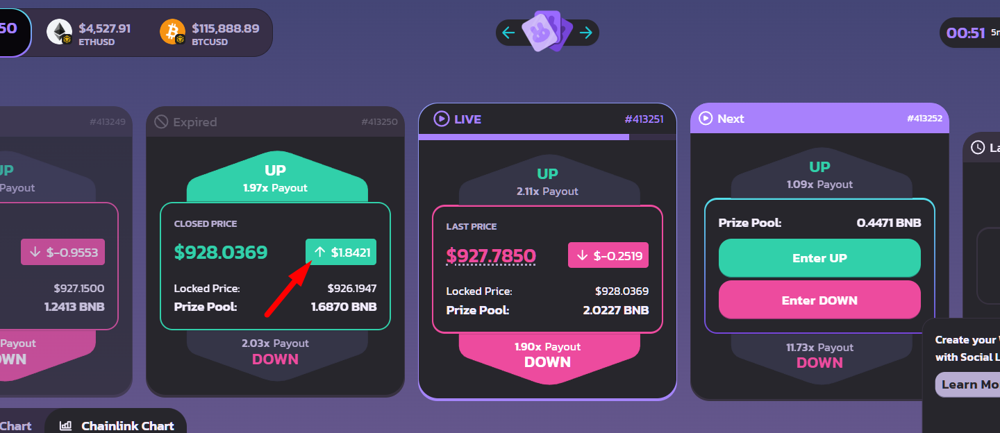

# ABOUT

This is my personal experiment, with the following goals:

1. Automate clicks in the pancakeswap.finance/prediction system
2. Isolate the click system from the main computer
3. Create the simplest possible auto-setup for project deployment
4. планируеться запустить 2 разных пользователя для сравнения стратегий
    - каждый из двух пользователей имеет отдельный metamask +50 USD
    - первый выполняет стратегию "anti-market"
    - второй выполняет стратегию "go-with-the-flow"
5. цель проверить какой из двух стратегий более прибыльный
    - ожидание - одна из стратегий перекачает средства из другой
    - и станет победителем теста 
    - она же продолжит чтобы посмотреть результят в долгосрок
    - все ставки делаються пока что по 0.002 BNB
6. далее сделаю ставку динамически
7. создать yaml USER DASHBOARD
8. отоброзить данные в HTML (view only)
9. запустить HTML страницу в интернете для внешнего доступа
10. автоматизировать процессы deploy с нуля и инструкции к ним

## What the project can do

- Places bets in PancakeSwap Prediction independently
- Uses screen coordinates for automated mouse clicks
- System requirements: Windows + Chrome + MetaMask


# Prohibitions and Recommendations

- Avoid moving the mouse unnecessarily to prevent shifting during execution
- Do not open MetaMask in a separate tab, as it cancels the MetaMask popup
- Do not resize the browser, as it will require reconfiguring the clicks
- Recommended to start with at least 100 USD in BNB, equivalent to 25 moves at 2.5 USD each
- Use only as a separate Windows user or on a dedicated computer
- Avoid moving the mouse unnecessarily, as it may disrupt execution

<!-- ---------------------- -->

<details>

  <summary>Instructions for clicks setup</summary>

<details>

<summary>CLICK_CANDLE_COLOR</summary>



</details>

</details>

<!-- ---------------------- -->

<details>

  <summary>For Development</summary>

### VERSION

- v.0.0.1 Automatically creates an order
- v.0.0.2 Automatically collects winnings
- v.1.0.0 Created an A_AUTORUN flow for auto-login after PC restart
- v.1.0.1 созданы примеры настройки с изоброжением
- v.1.0.2 осуществлены 4 стратегии
- v.1.0.3 начато осуществление C_SETUP

### IN FUTURE

- Plan to test functionality
- Including PC restart on a separate Windows user
- Plan to create a user-friendly click setup tool with hints
- Plan to conduct color tests when connecting pixels with color

# INSTALL

```
pip install -r requirements.txt
```

# RUN

```
python run.py
```

# DOWNLOAD UPDATED FROM REMOTE REPO

```
git pull
```

# UPDATE REMOTE REPO

```
git add .
git commit -m "v.1.0.3 начато осуществление C_SETUP"
git push

```

✅ ☑️ ✔️ ✳️ ❌ ❎ ✖️ 🔁 🔂 🔄
🚀 ⚙️ 💻 🔥 🧪 🐞 📝 🛠️ 🔄 🕒
📈 📉 🗂️ 📦 🎯 📚 🧰 🏁 🔔 💡
🛑 🔍 🏗️ 🧩 🧭 🛡️ 🍀 🌐 📢 🧯
🛫 🎉 🧿 🖥️ 💾 🧬 🧑‍💻 🧑‍🔬 📊 📋
📌 📎 🖱️ 🖨️ 🗃️ 📂 🗒️ 🛒 🧹 🖊️
🗑️ 🕹️ 🧲 🧱 🏷️ 🏆 🥇 📜 📅 🗓️ 🔗
🔒 🔓 🗝️ 🧊 🧞 🧺 🧳 📡 🏢 🏭
🏠 🏘️ 🏚️ 🌟 🎨 🧡 💙 💚 💛 💜
🩵 🩷 🔋 🧨 🧤 🧦 🧥 🧢 🧴 🧵
🧶 🛎️ 🛏️ 🛋️ 🚪 🚧 🚦 🚥 🚨 🚒
🚑 🚓 🗄️ 🗳️ 📫 📪 📬 📭 📮 📨
📩 📤 📥 📧 🔬 🔭 🕵️‍♂️ 🕵️‍♀️ 🧑‍🏫
🧑‍🔧 🧑‍🔩 🧑‍🎨 🧑‍🚀 🧑‍✈️ 🧑‍🚒 🧑‍⚕️ 🧑‍🎤 🔨 🔧
🔩 🗜️ 🖲️ 💾 💿 📀 📼 🧫 ⚡ 🌀
🌪️ 🛸 🎲 🎮 🐛 🐜 🦠 ⏫ ⏬ ⏩
⏪ ⏭️ ⏮️ 🆗 🆕 🆙
🪙 🪙 💰 💴 💵 💶 💷 💸 💳 🏦

</details>
